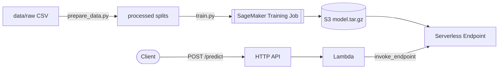

# aws-sagemaker-xgboost-churn

> [!NOTE]
> **Provenance:** Built to put a real, deployed model behind PrediktSales'
> case-studies page churn thesis - previously a static chart over the same
> public IBM Telco Customer Churn dataset, now a callable prediction API.
> Reviewed, tested, and versioned before public release.

A SageMaker built-in XGBoost model, trained via a real (billed-per-second,
self-terminating) training job, deployed behind a SageMaker Serverless
Inference endpoint, and fronted by an API Gateway + Lambda predict API - all
declaratively deployable with `sam deploy`, except the training job itself,
which isn't a good fit for CloudFormation (see
[docs/ARCHITECTURE.md](docs/ARCHITECTURE.md#cfn-vs-script-split)).



## Gotchas

Three real ones hit while building this - each is documented in more detail,
with a permanent anchor, in [docs/ARCHITECTURE.md](docs/ARCHITECTURE.md).

**`pip install sagemaker` installs a different SDK than every tutorial expects.**
As of this writing, an unpinned install gets you SageMaker Python SDK **v3**
- a ground-up rewrite (`sagemaker.train` / `sagemaker.core` / `sagemaker.serve`
/ `sagemaker.mlops`) with none of the classic `sagemaker.estimator.Estimator`
/ `sagemaker.image_uris.retrieve` API that this repo's scripts (and nearly
every existing SageMaker doc page or tutorial) are written against.
`requirements.txt` pins `sagemaker>=2.257,<3` deliberately - see
[docs/ARCHITECTURE.md#sdk-v3-gotcha](docs/ARCHITECTURE.md#sdk-v3-gotcha).

**A fresh AWS account has a training-job quota of 0 for every instance type.**
`CreateTrainingJob` fails outright with `ResourceLimitExceeded` until you
request a Service Quotas increase - free, but not instant (auto-approves in
minutes for some accounts, takes longer for others). Budget for that lead
time before your first `make train`. See
[docs/ARCHITECTURE.md#training-quota-gotcha](docs/ARCHITECTURE.md#training-quota-gotcha).

**`TotalCharges` is a string column with 11 silently-blank values.**
`pandas.read_csv` infers `object` dtype rather than erroring, and a naive
`.astype(float)` blows up. All 11 blank rows are brand-new customers
(`tenure == 0`) who haven't been billed yet - `churn_features.py` treats
that specific case as `$0` and raises on any other blank value. See
[notebooks/eda.ipynb](notebooks/eda.ipynb) for where this was first spotted.

## Dataset

[IBM Telco Customer Churn](https://raw.githubusercontent.com/IBM/telco-customer-churn-on-icp4d/master/data/Telco-Customer-Churn.csv) -
7,043 customers, 21 columns, a widely-used public benchmark. Not committed to
this repo: `scripts/download_data.sh` fetches it fresh from IBM's own GitHub
mirror, which sidesteps any question of this repo redistributing IBM's file
itself and guarantees you're training against the same data anyone else
running this script gets. No client data, no PII beyond the dataset's own
synthetic sample records.

## Prerequisites

- An AWS account and the AWS CLI configured with credentials that can create
  SageMaker, IAM, Lambda, and API Gateway resources.
- AWS SAM CLI installed (`sam --version`).
- Python 3.12 (matches the Lambda runtime and this repo's pinned deps).
- `pip install -r requirements.txt && pip install -e .` - installs the local
  pipeline deps and makes `churn_features` importable everywhere (scripts,
  tests, and - once packaged by `sam build` - the Lambda).

## Quickstart

```bash
pip install -r requirements.txt && pip install -e .

make data              # download + clean + stratified 70/15/15 split
make bootstrap-role     # one-time: creates the SageMaker training execution role
make train              # real training job on ml.m5.large, ~a few minutes, a few cents
make evaluate            # scores the held-out test set - see Evaluation below
make deploy              # sam build && sam deploy --guided
make predict              # smoke-tests the live deployed endpoint end to end
```

`make train` prints (and saves to `data/last_training_run.json`) the
`ModelDataUrl` and `ImageUri` values `make deploy` needs - a normal
train-then-deploy flow needs no manual copy-pasting between them.

`sam deploy --guided` will additionally prompt for:

| Parameter | Example | Notes |
|---|---|---|
| `ServerlessMemorySizeInMB` | `2048` | 1024–6144 MB, 1 GB increments |
| `ServerlessMaxConcurrency` | `5` | max concurrent endpoint invocations |
| `ChurnThreshold` | `0.5` | probability above which the API labels a customer "Yes" |
| `AllowedOrigin` | `https://example.com` | CORS origin for the predict API - set before using beyond local testing |

Answers are saved to `samconfig.toml` (gitignored - see
`samconfig.toml.example` for the format).

## Evaluation

Computed by `scripts/evaluate.py` against `data/processed/test.csv` - a
15% stratified split the model never saw during training or early stopping.
Written to [docs/evaluation-metrics.json](docs/evaluation-metrics.json).

| Metric | Model | Majority-class baseline |
|---|---|---|
| Accuracy | _pending real training run_ | _pending_ |
| Precision | _pending_ | _pending_ |
| Recall | _pending_ | _pending_ |
| AUC | _pending_ | _pending_ |

The baseline always predicts "No churn" (the majority class, ~73.5% of
customers) - it posts a deceptively high accuracy for doing nothing, but
0% recall: it never catches a single churner, which is the entire point of
building this model in the first place. `train.py` weights the minority
(churn) class via `scale_pos_weight`, trading some of that free accuracy for
real recall - see
[docs/ARCHITECTURE.md#class-imbalance-scale_pos_weight](docs/ARCHITECTURE.md#class-imbalance-scale_pos_weight).

## Live demo

```bash
curl -X POST https://YOUR-API-ID.execute-api.YOUR-REGION.amazonaws.com/predict \
  -H "Content-Type: application/json" \
  -d '{
    "SeniorCitizen": 0, "tenure": 2, "MonthlyCharges": 89.10, "TotalCharges": "178.20",
    "gender": "Female", "Partner": "No", "Dependents": "No", "PhoneService": "Yes",
    "MultipleLines": "No", "InternetService": "Fiber optic", "OnlineSecurity": "No",
    "OnlineBackup": "No", "DeviceProtection": "No", "TechSupport": "No",
    "StreamingTV": "Yes", "StreamingMovies": "Yes", "Contract": "Month-to-month",
    "PaperlessBilling": "Yes", "PaymentMethod": "Electronic check"
  }'
# {"churn_probability": 0.73, "churn_label": "Yes"}
```

Or `python3 scripts/invoke_endpoint.py --stack-name aws-sagemaker-xgboost-churn`,
which does the same thing and checks the response shape. Expect a
several-second cold start on the first request after a period of no
traffic - normal, expected behavior for Serverless Inference, not a bug (the
same latency trade-off already accepted by the Bedrock "ask your data" demo
on prediktsales.com).

A browsable demo page (same spirit as the Bedrock guardrails demo) is
planned as a follow-up addition to prediktsales.com, calling this repo's
deployed API directly - kept as a separate change so this repo stays fully
self-contained and independently deployable in the meantime.

## Cost estimate

Verified against current AWS pricing pages, not memory:

| Item | Rate | Realistic usage | Cost |
|---|---|---|---|
| Training (`ml.m5.large`) | $0.115/hr | ~2–5 min/run, a handful of dev iterations | a few cents, one-time |
| Serverless Inference (2 GB config) | $0.00004/sec compute | a few hundred predictions/mo | well under a cent/mo |
| API Gateway (HTTP API) | $1.00/million requests | a few hundred/mo | ~$0.0005/mo |
| Lambda | 1M requests/mo free tier | a few hundred/mo | $0 |
| S3 (model artifact + training data) | standard storage | a few MB | ~$0.001/mo |

Nothing here bills hourly at zero traffic - no real-time endpoint, no
notebook instance. `make clean` (`sam delete` + local artifact cleanup) is
the full teardown.

## Testing

```bash
pip install -r requirements.txt && pip install -e .
pytest tests/ -v
```

28 tests: pure-logic coverage of feature encoding (`churn_features.py`),
training-job hyperparameter construction (`train.py`), evaluation metrics
(`evaluate.py`), and the predict Lambda's request/response handling with a
mocked `sagemaker-runtime` client - no AWS credentials or deployed stack
required. `.github/workflows/ci.yml` runs this plus `sam validate --lint`
and `sam build` on every push/PR - no training job, no `sam deploy`, zero
AWS spend in CI. See
[docs/ARCHITECTURE.md](docs/ARCHITECTURE.md) for why a real training run
isn't (and can't cheaply be) part of that.

## Cleanup

```bash
make clean
```

Runs `sam delete` (removes the endpoint, Lambda, API Gateway, IAM hosting
role) and clears local processed-data/build artifacts. The training
execution role created by `make bootstrap-role` and the SageMaker default
bucket's contents aren't touched - delete those manually
(`aws iam delete-role`, `aws s3 rm`) if you want a fully clean account.

## Security / repo hygiene

No secrets, ARNs, or account IDs are committed. `samconfig.toml` (which
would hold your real stack name and region) is gitignored -
`samconfig.toml.example` shows the format with placeholder values. `data/`
is gitignored entirely - the dataset is fetched fresh by
`scripts/download_data.sh`, and `data/last_training_run.json` (which does
contain a real S3 URI once you've trained) never leaves your machine.

## Related

- [aws-bedrock-guardrails-sam](https://github.com/jeffgrosse/aws-bedrock-guardrails-sam) -
  same "standalone reference repo; live demo on prediktsales.com is a
  separate, thinner integration" split as this repo's planned demo page.
- [aws-serverless-lead-capture](https://github.com/jeffgrosse/aws-serverless-lead-capture) -
  same design philosophy (clarity over cleverness, fully parameterized SAM
  template) applied to a fully-CFN-native pattern.

## License

MIT — see [LICENSE](LICENSE).
