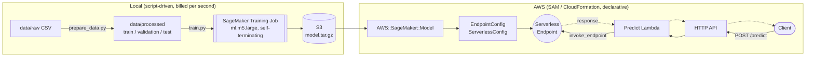

# Architecture

## Overview

Two halves with a deliberately hard seam between them: everything left of
the S3 artifact is a one-shot script run (`make data`, `make train`,
`make evaluate`); everything right of it is one `sam deploy`. The seam is
`ModelDataUrl` + `ImageUri` - two `template.yaml` parameters that
`scripts/train.py` prints at the end of a successful run.

## CFN-vs-script split

A SageMaker training job is one-shot, non-idempotent, billed-per-second
compute - there's no CloudFormation resource type for "run a job and record
where the output landed" that behaves the way CFN resources are supposed to
(create once, converge on repeated applies, roll back cleanly). Forcing it
into CFN would mean a Lambda-backed custom resource that itself calls
`CreateTrainingJob` and polls for completion during `sam deploy` - more
moving parts, a `sam deploy` that blocks for several minutes, and a stack
that can't cleanly no-op on a second deploy without extra bookkeeping. A
plain script (`scripts/train.py`, wired to `make train`) does the same job
with far less machinery.

Hosting is the opposite case: `AWS::SageMaker::Model`,
`AWS::SageMaker::EndpointConfig`, and `AWS::SageMaker::Endpoint` are exactly
the kind of resources CFN is good at - fully specified by their inputs,
safe to redeploy, naturally expressed as `Properties` blocks. `template.yaml`
covers the entire inference side, including the API Gateway HTTP API and
Lambda in front of it, so the demo is one `sam deploy` away from a trained
model artifact.

## Feature encoding and train/serve skew

`src/churn_features.py` is the one place customer records get turned into
the numeric vector XGBoost sees, and it's imported by both halves of the
pipeline: `scripts/prepare_data.py` and `scripts/evaluate.py` (pandas,
batch) and `src/predict_lambda/app.py` (stdlib-only, one record at a time).
That's deliberate - the built-in XGBoost algorithm has no notion of
categorical columns, so one-hot encoding happens entirely in this
application code, at both training time and inference time. If those two
encodings ever drifted apart (a column added at training time but not
serving time, a category level in a different order), the model would
silently score real predictions against a different feature space than the
one it was trained on - wrong answers with no error message anywhere.
`tests/test_predict_lambda.py` exists specifically to catch that: it asserts
the exact CSV row the Lambda sends to the endpoint, built through the same
`encode_record()` function `prepare_data.py` uses.

One consequence: `encode_record()` hardcodes each categorical column's
levels (`CATEGORICAL_FEATURES` in churn_features.py) rather than discovering
them from whatever data happens to be in a given batch - `pandas.get_dummies`
on a single-row inference request would only ever produce columns for the
values present in that one row, which is a different (and wrong) column set
than what training produced. Encoding a fixed, known level list is what
makes a single customer JSON object encode to the identical feature space a
full training batch does.

## Class imbalance: scale_pos_weight

The training split is ~26.5% churn / ~73.5% no-churn - a real but moderate
imbalance, not the kind that needs SMOTE or resampling, but enough that an
unweighted model tends to under-predict the minority class. `train.py`
computes `scale_pos_weight` (negatives / positives) from the actual training
split rather than hardcoding it, and passes it to the built-in algorithm's
hyperparameters. This is a deliberate choice to favor **recall on churners**
over raw accuracy - see the README's evaluation section for what that
trades off against the majority-class baseline, which gets a deceptively
high accuracy by construction (see below) but zero recall.

## `xgboost-version-pin`

`requirements.txt` pins `xgboost==1.7.6` locally, matching the SageMaker
built-in algorithm version this repo trains against (`1.7-1`, set as
`DEFAULT_XGBOOST_VERSION` in `train.py`). `scripts/evaluate.py` downloads
the training container's raw model artifact and loads it with a local
`xgb.Booster()` - if the local XGBoost version diverges too far from the
container's, loading that artifact isn't guaranteed to work. Pinning both
to the same version keeps "the booster your local machine loads" and "the
booster the container actually produced" the same thing.

## `sdk-v3-gotcha`

A real one, hit while writing `scripts/train.py`: `pip install sagemaker`
with no version constraint installs **v3** of the SageMaker Python SDK today
- a from-scratch rewrite (`sagemaker.train` / `sagemaker.core` /
`sagemaker.serve` / `sagemaker.mlops`) with none of the classic
`sagemaker.estimator.Estimator`, `sagemaker.image_uris.retrieve`,
`sagemaker.inputs.TrainingInput` API that essentially every existing
tutorial, blog post, and AWS doc page (as of this writing) is written
against. `requirements.txt` pins `sagemaker>=2.257,<3` deliberately -
without that pin, `train.py` as written would fail on import with confusing
`AttributeError`s, not because anything in this repo is wrong, but because
the installed SDK's module layout doesn't match what the code (correctly,
per current mainstream documentation) expects.

## `image-uri-resolution`

The built-in XGBoost algorithm's container image lives in an AWS-owned,
per-region ECR repository - historically documented as static per-region
account-ID tables. AWS has since retired those static docs pages in favor
of the SDK's `image_uris.retrieve()` helper (confirmed while building this:
the old per-region registry-path doc now redirects to a "this page has been
retired" notice). Rather than hand-copy a table of account IDs into
`template.yaml` that AWS no longer maintains a public reference for,
`scripts/train.py` resolves the image URI via
`sagemaker.image_uris.retrieve("xgboost", region, version="1.7-1")` - the
same call that already has to happen to kick off the training job - and
passes the result into `template.yaml` as the `ImageUri` parameter. The
inference stack stays pure declarative CFN; only the *value* fed into it is
resolved by the SDK instead of hardcoded.

## `training-quota-gotcha`

A brand-new AWS account (or one that's never run a SageMaker training job)
has an account-level Service Quota of **0** for every training-instance
type, `ml.m5.large` included - `CreateTrainingJob` fails outright with
`ResourceLimitExceeded` until that's raised. This isn't a SageMaker-specific
surprise so much as a generic AWS "new service, quota starts at zero"
pattern, but it's an easy first-run blocker: the fix is a one-time,
free [Service Quotas](https://console.aws.amazon.com/servicequotas/) request
for `ml.m5.large for training job usage` (quota code `L-611FA074`), which
can auto-approve in minutes or take up to ~24h for manual review depending
on account history. Budget for that lead time before your first `make train`
if you're setting this up in a fresh account.

## `region-default-footgun`

`boto3.Session()` with no explicit `region_name` resolves to your AWS CLI
profile's configured default region - not to any region this project
documents or assumes. That default has no reason to match the region you
actually want to train and deploy into, and when it doesn't, the failures
it produces don't look like a region problem:

- `scripts/train.py` (before this was fixed) submitted `CreateTrainingJob`
  against the profile's default region, which had its own (also zero)
  training-job quota - indistinguishable from the real quota-zero problem
  until checked directly, since the error message is identical either way.
- `scripts/bootstrap_training_role.sh` (before this was fixed) computed the
  training role's S3 policy against `$(aws configure get region)` - the
  role ended up scoped to the wrong region's default bucket ARN entirely,
  which only surfaced once training itself pointed at the *correct* region
  and got an access-denied `s3:ListBucket` failure that looked like an IAM
  policy bug, not a region mismatch.
- `scripts/invoke_endpoint.py` (before this was fixed) constructed an
  unregioned `boto3.client("cloudformation")` and failed with "Stack ...
  does not exist" against a stack that was very much deployed - just not in
  the region being queried.

All three now default to `us-east-1` explicitly (matching
`template.yaml` / `samconfig.toml.example`) instead of inheriting an
ambient CLI default. The general lesson: any script in this repo that talks
to AWS takes `--region` explicitly and defaults it to a value this project
controls, never to whatever a user's local profile happens to be set to -
a profile default is a reasonable convenience for ad hoc CLI use, and a
real correctness hazard for a script other people will run against their
own, differently-configured accounts.

**A follow-up review caught that the first fix was itself inconsistent**:
`bootstrap_training_role.sh` fell back to `AWS_DEFAULT_REGION` before
`us-east-1`, but `train.py` and `invoke_endpoint.py`'s `--region` default
was a static `"us-east-1"` with no environment-variable fallback at all -
exporting `AWS_DEFAULT_REGION` (the standard AWS convention, and the exact
variable this project's own CI sets) would have silently reproduced the
same class of bug the fix was supposed to eliminate, just for two of the
three scripts instead of all three. All three now read
`os.environ.get("AWS_DEFAULT_REGION", "us-east-1")` / the bash
equivalent identically. Still tracked as a follow-up: nothing in `tests/`
exercises this fallback chain for any of the three scripts (see the
README's Known follow-ups section), so a regression here wouldn't be
caught by CI either.

## `cold-start-retry`

Confirmed directly against the live endpoint: a request during a genuine
Serverless Inference cold start doesn't always just add latency - it can
come back as a `ModelError` ("Amazon SageMaker could not get a response
from the ... endpoint"), and the endpoint's own CloudWatch log group
(`/aws/sagemaker/Endpoints/<name>`) shows no record of the request ever
reaching the container for that attempt. `src/predict_lambda/app.py`'s
`_invoke_endpoint()` catches specifically that error code, sleeps briefly,
and retries once before giving up - every cold start hit while testing this
resolved on the retry. `template.yaml`'s Lambda `Timeout` (20s) was raised
from SAM's usual default specifically to leave room for this retry path
without the Lambda itself timing out first.

## `api-key-not-usage-plan`

The predict API started with no authentication at all - open by design for
a portfolio demo, but a review pass flagged it as unbounded exposure: a
scripted client could hit `/predict` indefinitely with no owner-side rate
limit, and each call is billed (SageMaker Serverless compute + Lambda). The
natural fix looked like API Gateway's usual answer - an API key plus a
usage plan - except that feature is **REST-API-only**. `AWS::Serverless::HttpApi`
(what `PredictApi` is, and what this template deliberately used from the
start for its lower cost/latency over `AWS::Serverless::Api`) has no API
key or usage plan concept at all; that's a documented, permanent
REST-vs-HTTP-API feature gap, not a configuration option to enable.

Two options, given that constraint: migrate `PredictApi` to a REST API to
get real API keys/usage plans, or keep the cheaper/simpler HTTP API and
approximate the access control by hand. This template does the latter -
a shared secret checked in `src/predict_lambda/app.py`'s `_authorized()`
via `hmac.compare_digest` against an `ApiKeyValue` CFN parameter
(`NoEcho: true`, no default), plus `DefaultRouteSettings` throttling
(2 req/s, burst 5) on the HTTP API itself. This is deliberately not
equivalent to REST API usage plans: the throttle is account-wide across
all callers, not per-client, and the "key" is a single shared value with
no rotation/revocation mechanism beyond redeploying with a new parameter
value. For a low-traffic portfolio demo, that's judged sufficient - it
stops a casual/accidental discovery-and-hammer scenario, which was the
actual risk, without taking on a REST API migration's added complexity
(different CORS config shape, different Lambda proxy integration
version, more resources) for a threat model that doesn't need it.

Practical implication: the `ApiKeyValue` parameter must be set at deploy
time (`openssl rand -hex 24` is a reasonable way to generate one), and
every caller - `curl`, `scripts/invoke_endpoint.py`, and a future demo
page - must send it as `X-Api-Key`. `NoEcho` keeps it out of the
CloudFormation console/change-set history, but it's still readable by
anyone with `lambda:GetFunctionConfiguration` on the account once
deployed (it's a Lambda environment variable, not a Secrets
Manager/SSM-backed secret) - a fine trade-off for this project's threat
model, worth knowing if you fork this for something with a higher bar.

## Cost model

SageMaker Serverless Inference bills per-millisecond of actual invocation
compute plus data processed - there is no charge while the endpoint sits
idle, unlike a real-time endpoint's standing per-hour instance cost. That's
the entire reason this template uses `ServerlessConfig` instead of a
`InstanceType`/`InitialInstanceCount` production variant. See the README's
cost estimate for current per-request pricing; the short version is that
realistic portfolio-demo traffic (tens to low hundreds of invocations/month)
costs a fraction of a cent.

## Region

No region lock in `template.yaml` - unlike
[aws-sam-static-website](https://github.com/jeffgrosse/aws-sam-static-website)
(hard-locked to `us-east-1` for CloudFront/ACM reasons), SageMaker Serverless
Inference and the built-in XGBoost algorithm are both available in most
commercial AWS regions. Just make sure `--region` passed to `scripts/train.py`
and the region you `sam deploy` into are the same one - `ModelDataUrl` and
`ImageUri` are both region-specific.

## Related

- [aws-bedrock-guardrails-sam](https://github.com/jeffgrosse/aws-bedrock-guardrails-sam) -
  same "reference pattern repo is standalone; the live demo on
  prediktsales.com is a separate, thinner integration" split as this repo's
  demo page.
- [aws-serverless-lead-capture](https://github.com/jeffgrosse/aws-serverless-lead-capture) -
  same design philosophy (clarity over cleverness, fully parameterized SAM
  template) applied to a different, fully-CFN-native pattern.
